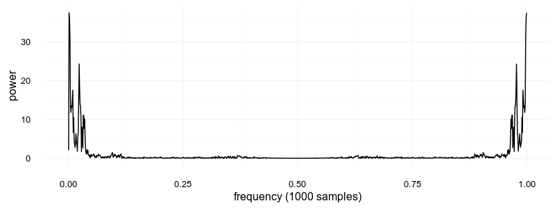

Zum kompilieren einfach einen neuen Ordner anlegen (zum Beispiel `build`)
und dort dann mit

```
cmake ..
make
```
die Quelldateien compilieren.
Das ganze sollte dann eine `sounddevice` Datei erstellen, die ausführbar ist.

Aktuell nimmt das Programm für 10 Sekunden auf, gibt dann alle Samples (40000 * 10)
in die Standardausgabe aus und dann über die Default-Lautsprecher.


**Update:** Fouriertransformation hinzugefügt.
Das Ergebnis wird in der Datei `fourier.csv` hinterlegt.

Beispiel Bild zu einem Zeitpunkt:
